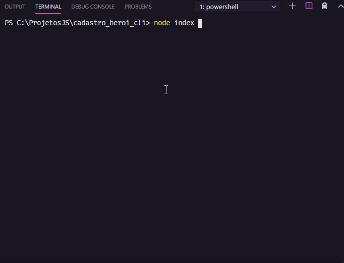

<h1 align="center">
    Cadastro de herois
</h1>

<h4 align="center"> 
	🚧 construção... 🚧
</h4>

<p align="center">
  
  </a>


## 💻 Sobre o projeto

Projeto CRUD de herois.

Projeto desenvolvido no curso de Imersão em desenvolvimento de APIs com Node.js.
Oferecido por [Erick Wendel](https://cursos.erickwendel.com.br/?origin=timeline#cursos_populares).




## 🛠 Tecnologias

As seguintes ferramentas foram usadas na construção do projeto:

- [Node.js][nodejs]


## Como executar o projeto

### Pré-requisitos

- [Node.js][nodejs]

### Executando o projeto

```bash
# Clone este repositório
$ git clone https://github.com/euRamiro/cadastro_heroi_cli/

# Acesse a pasta do projeto no terminal/cmd
$ cd cadastro_heroi_cli

# Instale as dependências
$ npm install

# Execute
$ node index --help

```


## 📝 Licença

Este projeto esta sobe a licença MIT.


[Contato!](https://www.linkedin.com/in/ramiro-da-silva-amorim/)

[nodejs]: https://nodejs.org/
[vscode]: https://code.visualstudio.com/
[license]: https://opensource.org/licenses/MIT